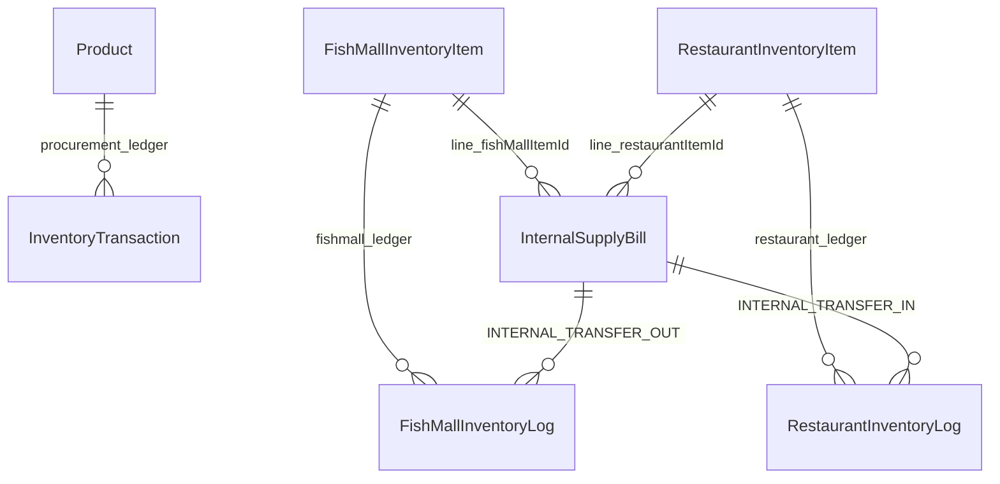

# Golden Fisheries — Inventory Architecture (v3)

## Summary

Three **isolated** inventory domains. Cross-domain stock bridges in production:

1. **Procurement → Fish Mall** via **Stock Transfer** (`StockTransfer`, `PT-####`) — admin approval, Mongo transaction.
2. **Fish Mall → Restaurant** via **Internal Supply Bill** (`InternalSupplyBill`, `INT-####`).

Procurement inventory is **never** reduced when Restaurant or Fish Mall sell at retail/POS.

| Domain | Model | Scope constant |
|--------|--------|----------------|
| **Procurement** | `Product` + `InventoryTransaction` | `PROCUREMENT` |
| **Fish Mall** | `FishMallInventoryItem` + `FishMallInventoryLog` | `FISHMALL` |
| **Restaurant** | `RestaurantInventoryItem` + `RestaurantInventoryLog` | `RESTAURANT` |

---

## Business chain (client view)

```
Procurement Inventory  (warehouse — stock in after buyer billing `PROCUREMENT_IN`)
        ↓  Stock Transfer (`PT-####`, approve → atomic move)
Fish Mall Inventory    (retail counter + internal supplier)
        ↓  Internal Supply Bill (INT-####)
Restaurant Inventory   (kitchen / POS stock)
        ↓  POS settle
Restaurant Sales       (customer orders)
```

**Procurement → Fish Mall:** `POST /api/v1/stock-transfers` → `PATCH .../approve` (Super Admin approves; Procurement Manager can create/cancel).

---

## Procurement flow

Harvest → Confirmation → Net Rate → Tapal → Driver → Buyer verify → **Buyer Billing** → `PROCUREMENT_IN` (stock available in warehouse).

Ledger types: `PROCUREMENT_IN`, `SALES_OUT`, `RETURN_IN`, `MANUAL_ADJUSTMENT`, `TRANSFER_OUT`.

Blocked on central ledger: `RESTAURANT_CONSUMPTION`, `FISHMALL_SALE`.

API: `/api/v1/inventory/*`

---

## Fish Mall flow

- **Procurement transfer in** → `receiveProcurementTransfer()` (`PROCUREMENT_TRANSFER_IN`)
- Retail POS → `fishMallInventoryService.deductForSale()` (`SALE_OUT`)
- **Internal bill to Restaurant** → `internalSupplyService.createFishMallToRestaurantBill()`
  - Mongo **transaction** — rollback on any failure
  - Fish Mall: `INTERNAL_TRANSFER_OUT` log, qty −
  - Restaurant: `INTERNAL_TRANSFER_IN` log, qty + (creates kitchen SKU by name if missing)
  - Invoice `INT-####` via sequence service (no duplicate invoice race)
- Daily P&L includes `internalSupplyTotal` (internal revenue to restaurant)

APIs:

| Method | Path | Role |
|--------|------|------|
| POST | `/fishmall/internal-bill/restaurant` | Fish Mall (manager + cashier) |
| GET | `/fishmall/internal-bill` | Fish Mall all |
| GET | `/fishmall/internal-bill/:id` | Fish Mall all |
| GET | `/fishmall/internal-bill/reports/*` | Fish Mall manager |
| GET | `/restaurant/internal-supplies` | Restaurant all (read-only) |
| GET | `/restaurant/internal-supplies/reports/receives` | Restaurant receive ledger |
| GET | `/api/v1/internal-supply/*` | Super Admin (full visibility) |

---

## Restaurant flow

- Stock in **only** via Fish Mall internal bills (`INTERNAL_TRANSFER_IN`) or manual `OPENING` / `ADJUSTMENT`
- **Never** reads procurement inventory
- **Menu + recipes** (`RestaurantMenuItem`) — POS dishes map to kitchen ingredient consumption per serve
- **Kitchen tickets** (`KitchenTicket`, `KOT-####`) — queue with PENDING → PREPARING → READY → SERVED
- **POS settle** → `deductForOrder()` expands recipes → `RECIPE_CONSUMPTION` ledger lines (atomic with payment)
- **Wastage** → `WASTAGE` log type on manual record
- APIs: `/restaurant/kitchen-tickets`, `/restaurant/menu`, `/restaurant/reports/*`

---

## Internal supply bill (data model)

**Collection:** `internalsupplybills`

| Field | Description |
|-------|-------------|
| `invoiceNumber` | Auto `INT-0001` |
| `fromScope` | `FISHMALL` |
| `toScope` | `RESTAURANT` |
| `lines[]` | `fishMallItemId`, `restaurantItemId`, `itemName`, `quantity`, `rate`, `amount` |
| `totalAmount` | Sum of lines |
| `createdBy` | User ref |

**Transaction safety:** MongoDB session + transaction in `internalSupply.service.js`; rollback on any line failure or negative Fish Mall stock.

---

## DB relationships (ER sketch)



---

## Affected modules / files (v3)

### Backend (procurement transfer)

- `modules/stock-transfer/stockTransfer.model.js`
- `modules/stock-transfer/stockTransfer.service.js`
- `modules/stock-transfer/stockTransfer.controller.js`
- `modules/stock-transfer/stockTransfer.routes.js`

### Backend (internal supply)

- `modules/internal-supply/internalSupplyBill.model.js`
- `modules/internal-supply/internalSupply.service.js`
- `modules/internal-supply/internalSupply.controller.js`

### Backend (updated)

- `modules/fishmall/fishMallInventory.model.js` — log enums
- `modules/fishmall/fishMallInventory.service.js` — `transferOutForInternal`, P&L
- `modules/fishmall/fishmall.routes.js` — internal bill routes
- `modules/restaurant/restaurantInventory.model.js` — log enums
- `modules/restaurant/restaurantInventory.service.js` — `receiveInternalTransfer`
- `modules/restaurant/restaurant.routes.js` — internal supplies read routes

### Frontend (new)

- `panels/fishmall/FishMallInternalSupply.jsx`

### Frontend (updated)

- `services/fishmallService.js`, `services/restaurantService.js`
- `router/index.jsx` — nav + route
- `store/adminStore.js` — deprecated client-side cross-transfer

---

## Safe implementation sequence

1. Deploy schema + enums (backward compatible — new log types only).
2. Deploy internal supply API (no procurement changes).
3. Deploy Fish Mall UI “Bill Restaurant”.
4. Train ops: restaurant kitchen stock comes from internal bills, not procurement.
5. Use **Transfer to Fish Mall** in admin inventory after buyer billing puts stock in procurement.

---

## Edge cases

| Case | Behavior |
|------|----------|
| Fish Mall qty &lt; bill qty | 400 error, full transaction rollback |
| Restaurant SKU missing | Auto-create `RestaurantInventoryItem` on receive |
| Duplicate fish names | Match by uppercase `name` |
| Cancelled bill | `status: CANCELLED` reserved — not implemented in v3 (issue-only) |
| Negative restaurant stock on POS | Blocked on settle (unchanged) |

---

## Rollback plan

1. Hide Fish Mall nav route `/fishmall/internal-supply`.
2. Revert routes registering `internalSupplyController` (procurement/restaurant POS unchanged).
3. Data: `InternalSupplyBill` + logs remain for audit; no need to delete.
4. Re-enable old client transfers **not recommended** — use manual `adjust` on each inventory if emergency.

---

## Client one-liner

> “Procurement, Fish Mall shop, and Restaurant kitchen are three separate stock books. When the restaurant needs fish, Fish Mall issues an internal bill — Fish Mall stock goes down and restaurant kitchen stock goes up automatically. Procurement stock is never touched by restaurant sales.”
