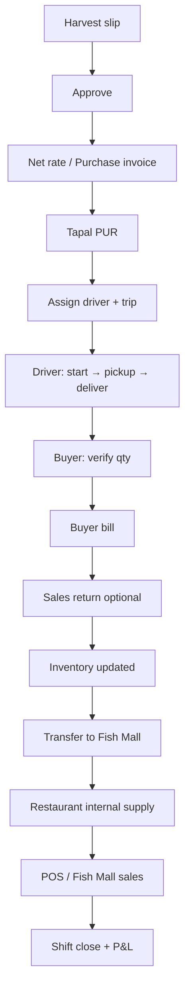

# Golden Fisheries — Manual End-to-End Test Guide

Use this after `npm run db:reset-operational` (optional clean slate).  
**Login methods:** Admin ERP = phone + **password** (`/auth/admin`) — includes **Buyer** on mobile. **Driver** = OTP (`/auth/driver`). Restaurant/Fish Mall = OTP on their auth URLs.

---

## Before you start

| Step | Command / URL |
|------|----------------|
| Start API | `cd backend` → `npm run dev` |
| Start UI | `cd frontend` → `npm run dev` |
| Health check | `http://localhost:5000/health` |
| App home | `http://localhost:5173/auth/home` |
| Restaurant login | `http://localhost:5173/restaurant/auth` |
| Fish Mall login | `http://localhost:5173/fishmall/auth` |
| Restaurant dashboard | `http://localhost:5173/restaurant/dashboard` |
| Fish Mall dashboard | `http://localhost:5173/fishmall/dashboard` |
| **Clean DB (users only)** | `cd backend` → `npm run db:reset` |
| **Clear stale UI** | Logout → Ctrl+Shift+R (or clear browser site data) |

`npm run db:reset` deletes **everything except user accounts** (no farmers, products, tapals, orders). Nothing is auto-seeded.

### Test users (if you ran `npm run seed:e2e`)

| Role | Phone | Password |
|------|-------|----------|
| Procurement | 9000000001 | `e2e_test_123` |
| Buyer | 9000000002 | `e2e_test_123` |
| Driver | 9000000003 | `e2e_test_123` |
| Vehicle Mgr | 9000000004 | `e2e_test_123` |
| Rest Manager | 9000000005 | `e2e_test_123` |
| Fish Mall Mgr | 9000000007 | `e2e_test_123` |
| Rest Cashier | 9000000006 | `e2e_test_123` |
| Fish Mall Cashier | 9000000008 | `e2e_test_123` |

Use **your real admin user** (from DB) for Super Admin steps if not using seed.

### Master data you need first (Admin web)

- At least **1 farmer**, **1 product** (with stock), **1 external buyer**, **1 vehicle**, **1 driver user** linked to vehicle (Logistics → Drivers).

---

## Integrations you can add LATER (safe)

| Integration | Blocks core ERP? | Without it |
|-------------|------------------|------------|
| **WhatsApp Cloud API** | **No** | Backend logs “would send” and continues. Harvest slip “Share on WhatsApp” opens **phone browser** (`wa.me`) — no API key needed. |
| **SMS India Hub** | **No** for password login | Password login works. OTP panels need DLT + `.env` (see `backend/.env.example`). Dev OTP is `123456` unless `SMS_FORCE_SEND=true`. |
| **Google Maps API** | **No** for full lifecycle | Trip start/pickup/delivery/billing work. Driver GPS may still save to DB; **map tiles/geocode** may be empty until key is set. |
| **Cloudinary** | Usually **no** for trip POD | Delivery proof can be **base64** from phone camera. |

**Conclusion:** You can go live with procurement → tapal → driver → buyer → restaurant/fishmall **without** WhatsApp, SMS, or Maps keys. Add them later for notifications and live map polish only.

Optional `.env` when ready (copy `backend/.env.example`):

```env
# SMS India Hub — panel: cloud.smsindiahub.in → API
SMS_PROVIDER=smsindiahub
SMS_API_KEY=<from API section>
SMS_SENDER_ID=<6-char DLT sender>
SMS_ENTITY_ID=<DLT entity / PE id>
SMS_DLT_TEMPLATE_ID=<approved OTP template id>
SMS_OTP_TEMPLATE=<exact DLT template text with {otp} placeholder>

WHATSAPP_ACCESS_TOKEN=
WHATSAPP_PHONE_NUMBER_ID=
GOOGLE_MAPS_API_KEY=
```

Test SMS: `cd backend` → `npm run test:sms -- 9876543210` (10-digit number).  
Integration status: `GET /api/v1/integrations/status` (no auth).

---

## Flow overview



---

## PHASE 0 — Master data (Super Admin · Web)

**Login:** `/auth/admin` → lands on `/admin/dashboard`

| # | Screen | Path | What to do | Pass if |
|---|--------|------|------------|---------|
| 0.1 | Farmers | Procurement → Farmers / create in harvest flow | Create farmer with phone, location | Saves, appears in list |
| 0.2 | Products | Inventory → add item | Create product, note opening qty | Stock visible in inventory |
| 0.3 | Buyers | Admin buyers module | External buyer + address | Buyer selectable on tapal |
| 0.4 | Vehicles | `/admin/vehicles` | Add vehicle AVAILABLE | Shows in assign driver |
| 0.5 | Drivers | `/admin/logistics/drivers` | Driver user + profile + vehicle link | Assign driver succeeds |

**Print check (optional):** open any harvest preview → Print preview layout.

---

## PHASE 1 — Harvest (Procurement · Mobile UI)

**Login:** `/auth/admin` with procurement phone → auto `/mobile/procurement/harvest`

| # | Screen | Path | What to do | Pass if |
|---|--------|------|------------|---------|
| 1.1 | New slip | `/mobile/procurement/harvest/new` | Farmer, products, boxes, weight, pickup details | Status CREATED, H-number generated |
| 1.2 | Preview | Preview step | Review slip fields match paper | Print layout OK |
| 1.3 | List | `/mobile/procurement/harvest` | Slip appears in list | Correct status |

**Do not** enter rates on create (pricing comes at net rate).

---

## PHASE 2 — Approval (Super Admin or Mobile)

| # | Who | Action | Pass if |
|---|-----|--------|---------|
| 2.1 | Super Admin **web** `/admin/procurement/harvest/:id` OR mobile status | Approve → **CONFIRMED** | Status CONFIRMED, no duplicate corruption on re-approve |

---

## PHASE 3 — Net rate / Purchase invoice (Procurement)

| # | Screen | Path | What to do | Pass if |
|---|--------|------|------------|---------|
| 3.1 | Net rate | `/mobile/procurement/net-rate` or detail link | Enter rates, TDS, commission, soft, deductions | `netRateCalculated`, payable amount saved |
| 3.2 | Verify formula | Detail page | Gross − deductions = net (match client paper) | Numbers consistent |

---

## PHASE 4 — Tapal from harvest (Procurement)

| # | Screen | Path | What to do | Pass if |
|---|--------|------|------------|---------|
| 4.1 | Create tapal | `/mobile/procurement/tapal` | Select approved harvest, buyer | **PUR-** tapal created, qty = harvest qty |
| 4.2 | Admin tapal | `/admin/tapals/:id` | Open tapal | Linked harvest, buyer, status correct |

---

## PHASE 5 — Logistics (Super Admin · Web)

| # | Screen | Path | What to do | Pass if |
|---|--------|------|------------|---------|
| 5.1 | Assign driver | `/admin/logistics/assign-driver` | Tapal + driver + vehicle | Trip created, tapal ASSIGNED |
| 5.2 | Trips list | `/admin/logistics` | See active trip | Trip number visible |

---

## PHASE 6 — Driver (Driver · Mobile)

**Login:** `/auth/driver` (not admin login)

| # | Screen | Path | What to do | Pass if |
|---|--------|------|------------|---------|
| 6.1 | Dashboard | `/driver/dashboard` | See assigned trip | Trip listed |
| 6.2 | Active trip | `/driver/active-trip` | **Start trip** | Status in transit |
| 6.3 | Pickup | Load modal | Enter **actual pickup qty** (actualQty) | Picked status |
| 6.4 | Delivery | Delivery modal | **Real photo** + signature + delivered qty | Delivered, no fake “simulate” |
| 6.5 | Expenses | Trip expense / end sheet | Fuel, KM, batta, etc. | Admin sees trip completed popup |
| 6.6 | Print | Expense bill print route | Print driver end trip sheet | Fields match paper |

**Maps note:** Live map is optional; GPS ping may run in background without Google key.

---

## PHASE 7 — Buyer (Buyer · Mobile via Admin login)

**Login:** procurement-style → `/auth/admin` with buyer phone → `/mobile/buyer/...`

| # | Screen | Path | What to do | Pass if |
|---|--------|------|------------|---------|
| 7.1 | Incoming | `/mobile/buyer/tapals` | Tapal appears after delivery | Listed |
| 7.2 | Verify | Verify screen | Dispatched vs received qty, remarks | Verification saved |
| 7.3 | Bill | Bill view | Rate, final weight, generate bill | Bill number, amount |
| 7.4 | Print | Buyer bill print | Print layout | Matches client bill format |
| 7.5 | Return (optional) | `/mobile/buyer/returns` | Create return linked to bill | Return amount computed |
| 7.6 | Approve return | Admin web | Approve return | Inventory adjusted |
| 7.7 | Reconciliation | `/mobile/buyer/reconciliation` | Open reconciliation | Totals load from API |

---

## PHASE 8 — Inventory check (Super Admin)

| # | Screen | Path | Pass if |
|---|--------|------|---------|
| 8.1 | Inventory | `/admin/inventory` | Stock reflects procurement in − sales out |
| 8.2 | No negative | Try over-issue transfer | Error if insufficient stock |

Formula to verify manually:

`Opening + Procurement − Buyer sales − Internal issues + Returns = Closing`

---

## PHASE 9 — Procurement → Fish Mall (Super Admin)

| # | Screen | Path | What to do | Pass if |
|---|--------|------|------------|---------|
| 9.1 | Transfer | `/admin/inventory/transfer-fishmall` | Create transfer, dispatch | Fish Mall alert/notification |
| 9.2 | Fish Mall stock | `/fishmall/stock` | Receive transfer | Qty increases |

---

## PHASE 10 — Fish Mall → Restaurant (Fish Mall Manager)

**Login:** `/fishmall/auth`

| # | Screen | Path | What to do | Pass if |
|---|--------|------|------------|---------|
| 10.1 | Open shift | `/fishmall/dashboard` | Opening cash float | Session open |
| 10.2 | Internal bill | `/fishmall/internal-supply` | Bill restaurant lines | Bill PENDING_ACCEPTANCE |
| 10.3 | Rates | `/fishmall/rates` (manager only) | Cashier **cannot** change rates | RBAC OK |
| 10.4 | Billing | `/fishmall/billing` | Weight sale | Sale + cashbook entry |
| 10.5 | Close shift | `/fishmall/closing` | Physical cash count | Session closed |

---

## PHASE 11 — Restaurant (Rest Manager)

**Login:** `/restaurant/auth`

| # | Screen | Path | What to do | Pass if |
|---|--------|------|------------|---------|
| 11.1 | Open shift | `/restaurant/dashboard` | Opening float | Session open |
| 11.2 | Receive stock | `/restaurant/received-stock` | Accept internal bill | Kitchen stock ↑ |
| 11.3 | POS | `/restaurant/pos` | Dine-in order, pay | Order completed |
| 11.4 | Kitchen | `/restaurant/kitchen` | Ticket from POS | Status updates |
| 11.5 | Inventory | `/restaurant/inventory` | Stock matches consumption | Qty logical |
| 11.6 | Close shift | Dashboard closing modal | Cash + UPI actuals | P&L on dashboard |

---

## PHASE 12 — Reports & RBAC (quick checks)

| # | Test | Pass if |
|---|------|---------|
| 12.1 | `/admin` reports / finance P&L | Loads without error |
| 12.2 | Driver opens `/admin/dashboard` | Blocked or no admin menu |
| 12.3 | Buyer opens `/admin/procurement/harvest` | 403 / hidden |
| 12.4 | Rest cashier opens admin reports | Hidden |
| 12.5 | Fish Mall cashier opens `/fishmall/rates` | Denied |

---

## PHASE 13 — Realtime (optional)

| # | Test | Pass if |
|---|------|---------|
| 13.1 | Open admin + fish mall + restaurant same time | Notification bell updates on transfer |
| 13.2 | Driver completes trip | Admin trip popup (if socket connected) |
| 13.3 | Refresh page after action | Data matches DB (no stale mock) |

---

## Automated API audit (optional)

With backend running:

```bash
cd backend
npm run seed:e2e      # once
npm run test:e2e      # full API lifecycle
```

---

## Per-phase checklist (printable)

Copy and tick:

```
[ ] Phase 0  Master data
[ ] Phase 1  Harvest create
[ ] Phase 2  Harvest approve
[ ] Phase 3  Net rate / PI
[ ] Phase 4  Tapal PUR
[ ] Phase 5  Assign driver
[ ] Phase 6  Driver trip complete (real photo)
[ ] Phase 7  Buyer verify + bill (+ return)
[ ] Phase 8  Inventory reconciliation
[ ] Phase 9  Transfer to Fish Mall
[ ] Phase 10 Fish Mall shift + sale + internal bill
[ ] Phase 11 Restaurant receive + POS + close
[ ] Phase 12 Reports + RBAC
[ ] Phase 13 Realtime notifications
```

---

## If something fails

| Symptom | Likely cause |
|---------|----------------|
| Login 401 | Wrong phone/password; user inactive |
| Harvest approve 403 | Use mobile approve or super admin with permission |
| No stock for Fish Mall sale | Run inventory adjust or complete procurement first |
| Driver no trip | Driver profile not linked / wrong user |
| Tapal create error | Harvest not CONFIRMED or net rate missing |
| Empty map | Google Maps key not set — **not a blocker** |
| No SMS | SMS key not set — **not a blocker** for password login |

---

*This guide follows the client seafood workflow only — no alternate SaaS flows.*
